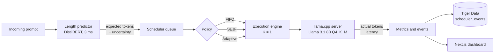
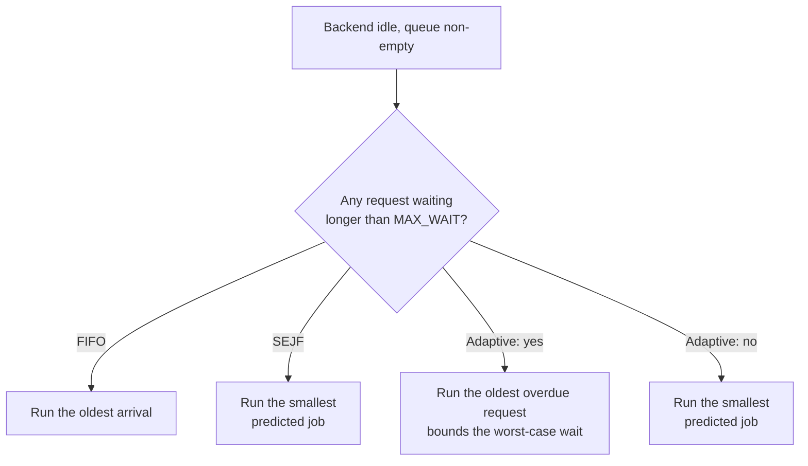

# Adaptive LLM Inference Scheduler

Predict how long an LLM response will be *before* generating it, then use that estimate to decide
what runs next. Measured end-to-end on a real local Llama 3.1 8B deployment — not simulated.

**Headline result, measured on an RTX 3060 Ti:** reordering a queue by predicted response length
cut short-request mean latency from **14.0 s to 7.0 s** (−50%) on 112 held-out prompts, with the
cost showing up exactly where theory says it should — the tail (p99 57.8 s → 80.6 s). A third,
fairness-aware policy then recovered the tail to **51.8 s**, better than either.

Throughput was flat at ~7.9 req/min across every policy, which is the correct result at
concurrency 1 with no preemption: reordering a queue cannot create decode capacity. No throughput
improvement is claimed anywhere in this project.

---

## The problem

A self-hosted LLM assistant serves a mix of cheap and expensive prompts through one GPU. Served
first-come-first-served, a 1,000-token essay request blocks a 20-token factual lookup behind it.
That is head-of-line blocking, and it dominates perceived latency.

```mermaid
gantt
    title Illustrative - one long request blocking three short ones (concurrency = 1)
    dateFormat X
    axisFormat %s
    section FIFO
    LONG  (900 tok)   :0, 12
    short (40 tok)    :12, 13
    short (35 tok)    :13, 14
    short (50 tok)    :14, 15
    section Shortest-Estimated-Job-First
    short (40 tok)    :0, 1
    short (35 tok)    :1, 2
    short (50 tok)    :2, 3
    LONG  (900 tok)   :3, 15
```



Same work, same finish time, radically different experience for the three short requests. The
catch: you cannot order by response length because you do not know it yet. So predict it.

---

## Architecture



The predictor and the scheduler are deliberately decoupled: the scheduler only consumes
`predict(prompt) -> {expected_output_tokens, uncertainty}`, so the model behind it can be swapped
without touching scheduling logic. The backend runs with **one slot** (`-np 1`) so that our queue
order *is* the execution order — otherwise the server's own batching would silently invalidate the
experiment.

---

## The three policies



`MAX_WAIT` is derived, not guessed: **3 × the measured median service time** (3 × 4,693 ms =
14,079 ms), computed from 3,001 real generations rather than hardcoded.

---

## Measured results

112 held-out prompts the predictor never trained on, one frozen arrival trace replayed under each
policy. Before comparing, the harness asserts the runs are like-for-like — same manifest, backend,
generation settings, request set, arrival timestamps, and **predictor outputs matching to 0.0000
tokens**. Only execution order differed. Zero failed requests.

| Metric | FIFO | SEJF | Adaptive |
| --- | --- | --- | --- |
| Mean latency | 16.65 s | **13.36 s** | 15.75 s |
| p50 latency | 12.27 s | **8.78 s** | 10.62 s |
| p95 latency | 48.70 s | 51.65 s | **44.18 s** |
| p99 latency | 57.76 s | 80.56 s | **51.80 s** |
| **Short-request mean latency** | 14.02 s | **7.03 s** | 13.66 s |
| Max queue wait | 54.75 s | 72.17 s | **48.78 s** |
| Throughput | 7.94 req/min | 7.94 req/min | 7.95 req/min |

**What this actually shows — a three-way tradeoff, not a winner.** SEJF optimises the body of the
latency distribution. Adaptive optimises the tail, beating *both* other policies on p95, p99 and
max wait. FIFO does neither well.

Adaptive does **not** keep SEJF's short-job win, and that result is worth more than a clean story.
Investigating it: the policy chose by shortest-estimate 69% of the time (it was not degenerating to
FIFO), and raising `MAX_WAIT` to 5 × median made every metric slightly *worse*. The cause is
structural — at concurrency 1 with no preemption, promoting one overdue long request blocks every
short request behind it for that request's full service time, and service times are heavy-tailed
here (p50 output 407 tokens, p90 918). Bounded waiting has a real, measurable price.

Full numbers, validation tables and the raw event streams:
**[`docs/measurements/`](docs/measurements/)** · [`docs/REAL_RESULTS.md`](docs/REAL_RESULTS.md) ·
[`STATUS.md`](STATUS.md)

Every measurement is committed to this repository, so the results stand on their own without the
Tiger Cloud instance, the local run directory, or the machine that produced them.

---

## The predictor

A DistilBERT regressor over 20 quantile bins, trained on output lengths measured from the real
serving stack. It returns a full distribution, not just a point estimate, so a scheduler can use
confidence later.


Selection was gated on three criteria agreed in advance — beat the baseline on MAE, beat or tie it
on severe underprediction, and keep inference overhead under 5% of service time:

| | DistilBERT | Prompt-length baseline | |
| --- | --- | --- | --- |
| Test MAE | **193.1 tokens** | 241.5 tokens | 20% better |
| Severe underprediction | **0.089** | 0.143 | better |
| Inference latency | **2.8 ms** | — | 0.06% of 4,693 ms service time |

It passed in **all 9** training runs (three input lengths × three dataset sizes), so the verdict
does not hinge on one split. The learning curve was still improving at 750 prompts
(MAE 246.7 → 217.2 → 193.1), so more data would likely help further.

Target is the **p90** of four generations per prompt, not the mean — underprediction causes
head-of-line blocking, so the label is deliberately conservative.

---

## Repository layout

| Path | What |
| --- | --- |
| [`ml/`](ml/) | DistilBERT length predictor, prompt-length baseline, training, evaluation, success bar |
| [`datagen/`](datagen/) | LMSYS preprocessing, category-balanced sampling, resumable label generation, checkpoints |
| [`scheduler/`](scheduler/) | Request model, K=1 engine, FIFO/SEJF/Adaptive policies, metrics, manifests, Tiger Data sink, CLI |
| [`ui/`](ui/) | Next.js dashboard — queue reordering, execution timeline, live metrics, run comparison |
| [`tests/`](tests/) | 186 tests across ML, data generation and scheduling |
| [`scripts/`](scripts/) | Server launch, resumable generation driver, experiment runners |
| [`docs/`](docs/) | Runbook, demo flow, design notes, research papers |
| [`docs/measurements/`](docs/measurements/) | **Archived real measurements** — every event stream and summary, committed |

---

## Quickstart

Requires Python 3.11, Node ≥ 18.18, and an NVIDIA GPU for real inference.

```bash
# 1. environment
python -m venv .venv && .venv/Scripts/activate        # Windows
pip install -r requirements.txt
pytest                                                 # 186 tests, no GPU needed

# 2. simulated scheduling, no GPU and no model required
python -m scheduler run --backend mock --predictor mock --policy sejf --n 60
python -m scheduler report scheduler_runs/*

# 3. dashboard
cd ui && npm install && npm run dev                    # http://localhost:3000
```

Reproducing the real experiment needs a llama.cpp server and the trained artifacts; the full
sequence is in [`docs/RUNBOOK_REAL_EXPERIMENT.md`](docs/RUNBOOK_REAL_EXPERIMENT.md).

---

## Engineering notes

The parts I would want to be asked about.

**Measurement validity was the binding constraint, not model accuracy.** The backend runs one slot
so queue order equals execution order; every policy replays a frozen manifest; the comparison tool
refuses to compare runs that differ in anything but policy. Without those, any result would be
unattributable.

**A reproducibility bug invalidated a planned experiment, and I reported it instead of shipping
around it.** llama.cpp reuses its KV/prompt cache between requests, so the same prompt and seed is
not reproducible: a request recorded at the 1024-token cap deterministically returns 539 tokens
with `cache_prompt: false`. That killed a planned pass to un-censor truncated labels — you cannot
re-run a cache-affected generation and recover its true length. The partial results were
quarantined, never used, and the dataset is documented as *not* seed-reproducible.

**Known limits, stated plainly.** 9.9% of label generations hit the 1024-token cap and are
right-censored (flagged per-record). The predictor test set is 112 examples, enough to choose a
model but thin for a strong accuracy claim. The dataset is 750 prompts rather than the planned
2,000, cut deliberately to fit the time budget — the pipeline is resumable and the checkpoints are
nested so the larger run remains available.

**Throughput is reported as a sanity check only.** At K=1 without preemption, reordering cannot
improve it, and a change would have signalled a stall or failure rather than a win.

---

## Research basis

Two papers shaped the design. What was taken from each, and what was not:

**Zheng et al. (2023)** established that response length can be perceived before generation and
used to schedule, and that repeated generations give a conservative target. This project takes the
core premise, the p90-over-repeats labelling, and the principle that underprediction is more
harmful than overprediction. It does **not** use their LLM-as-its-own-predictor approach — a
separate small model keeps predictor cost off the serving GPU and measurable in isolation.

**Xie et al. (2026)** frame output-length prediction as a heavy-tailed problem better served by a
distribution over length bins than a point estimate, with soft labels preserving distance between
neighbouring bins. This project takes the 20-quantile-bin head, the soft labels, the reconstruction
of expected length from bin probabilities, and MAE as the primary metric. It does **not** implement
their EGTP hidden-state pooling: that requires hooks into the serving model's internals, which
would have coupled the predictor to llama.cpp and made the overhead much harder to attribute.
A DistilBERT auxiliary model was chosen instead for isolation and debuggability.

### References

> Zheng, Z., Ren, X., Xue, F., Luo, Y., Jiang, X., and You, Y. (2023).
> *Response Length Perception and Sequence Scheduling: An LLM-Empowered LLM Inference Pipeline.*
> National University of Singapore; Noah's Ark Lab, Huawei.
> Code: <https://github.com/zhengzangw/Sequence-Scheduling> ·
> local copy: [`docs/research/Zheng23.pdf`](docs/research/Zheng23.pdf)

> Xie, H., Chen, Y., Wang, L., Hu, L., and Wang, D. (2026).
> *Predicting LLM Output Length via Entropy-Guided Representations.*
> Published as a conference paper at **ICLR 2026**.
> King Abdullah University of Science and Technology (KAUST); PRADA Lab;
> Mohamed bin Zayed University of Artificial Intelligence (MBZUAI).
> Local copy: [`docs/research/EGTP.pdf`](docs/research/EGTP.pdf)

Dataset: **LMSYS-Chat-1M** (Zheng et al., 2023), used under its terms —
<https://huggingface.co/datasets/lmsys/lmsys-chat-1m>. No prompt text from it is redistributed in
this repository.

---

## Stack

Python 3.11 · PyTorch · Transformers (DistilBERT) · llama.cpp (CUDA) · Llama 3.1 8B Instruct Q4_K_M
· Tiger Data / TimescaleDB · Next.js · TypeScript · pytest

Built for MHacks 2026.
